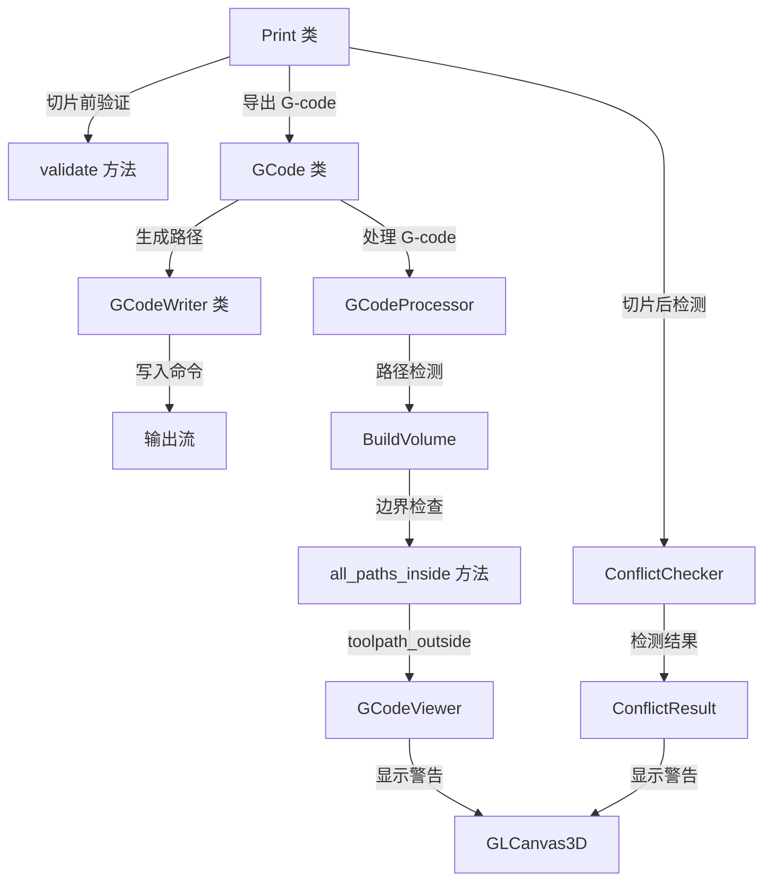

# OrcaSlicer G-code超限检测优化技术文档

> **项目编号**: ORCA-2026-001
> **创建日期**: 2026-01-15
> **作者**: Claude Code
> **状态**: ✅ 已完成

> **重要说明**：本文档是设计阶段的原始文档。实际实现与设计有一些差异：
> - 原设计在 `BuildVolume` 中添加 `all_moves_inside()` 方法
> - **实际实现**：Travel 检查采用内联方式在 `GCodeViewer.cpp` 中实现，以便收集详细的违规信息（类型、方向、位置、距离）
> - 这是因为需要返回详细的 `BoundaryViolationInfo` 结构，而不是简单的布尔值

---

## 目录

1. [项目概述](#1-项目概述)
2. [当前系统架构分析](#2-当前系统架构分析)
3. [G-code生成和验证流程](#3-g-code生成和验证流程)
4. [问题分析](#4-问题分析)
5. [优化方案设计](#5-优化方案设计)
6. [风险评估](#6-风险评估)
7. [实施计划](#7-实施计划)
8. [参考资料](#8-参考资料)

---

## 1. 项目概述

### 1.1 背景

OrcaSlicer 当前存在部分 G-code 路径超出打印边界但未能正确检测和警告的问题，这可能导致：
- 打印头撞击打印床边界导致硬件损坏
- 打印失败但用户不知道原因
- 用户体验差，对软件质量产生质疑

### 1.2 目标

**核心目标**：确保所有超出打印边界的 G-code 路径都能被检测并警告用户。

**具体目标**：
1. 调研并文档化当前 G-code 超限检测逻辑和框架
2. 识别并修复所有超限切片不报错的场景
3. 实现警告提示机制（允许继续但高亮警告）
4. 添加测试用例防止回归

### 1.3 交付物

- ✅ 完整的技术文档（本文档）
- ⏳ 修复所有8个已识别的关键漏洞
- ⏳ 单元测试和集成测试用例
- ⏳ 代码实现和 Code Review

---

## 2. 当前系统架构分析

### 2.1 整体架构概述

OrcaSlicer 实现了**两套独立的超限检测系统**：

#### 系统 A: 物体边界检测 (Object Bounds Checking)
- **功能**: 检测 3D 模型是否超出打印平台边界
- **触发时机**: 模型放置、移动、导出前
- **核心类**: `BuildVolume`
- **检测粒度**: 模型级别（基于包围盒和网格）

#### 系统 B: G-code 路径冲突检测 (G-code Conflict Checking)
- **功能**: 检测切片后 G-code 路径是否发生对象间冲突
- **触发时机**: 切片完成后
- **核心类**: `ConflictChecker`
- **检测粒度**: 路径级别（基于线段相交）

**关键发现**: 这两套系统各自独立，存在检测盲区。

---

### 2.2 核心类和文件结构

#### 2.2.1 冲突检测核心

**ConflictChecker** (`src/libslic3r/GCode/ConflictChecker.hpp/cpp`)

```cpp
struct LineWithID {
    Line          _line;      // 线段几何
    const void *  _id;        // 所属对象指针
    ExtrusionRole _role;      // 挤出角色(支撑/填充/外壁等)
};

struct ConflictChecker {
    static ConflictResultOpt find_inter_of_lines_in_diff_objs(
        PrintObjectPtrs objs,
        std::optional<const FakeWipeTower *> wtdptr
    );
    static ConflictComputeOpt find_inter_of_lines(const LineWithIDs &lines);
    static ConflictComputeOpt line_intersect(const LineWithID &l1, const LineWithID &l2);
};
```

**核心算法**：
1. **栅格化加速** (Rasterization)：使用 1mm × 1mm 网格将线段映射到空间
2. **并行检测**：使用 TBB 并行处理各层
3. **早期退出**：找到第一个冲突即停止

**性能优化**：
- 复杂度从 O(n²) 降低到接近 O(n)
- 使用 3D DDA 算法进行高效栅格化

**关键代码位置**：
- 栅格化: `ConflictChecker.cpp:25-86`
- 冲突检测主函数: `ConflictChecker.cpp:220-284`
- 线段相交判定: `ConflictChecker.cpp:286-308`

#### 2.2.2 打印体积边界检测核心

**BuildVolume** (`src/libslic3r/BuildVolume.hpp/cpp`)

```cpp
enum class BuildVolume_Type {
    Invalid,
    Rectangle,   // 矩形打印床（最常见）
    Circle,      // 圆形打印床（Delta 打印机）
    Convex,      // 凸多边形打印床
    Custom       // 自定义形状打印床
};

enum class ObjectState {
    Inside,      // 完全在打印体积内，可打印
    Colliding,   // 与边界碰撞，不可打印
    Outside,     // 完全在打印体积外，被忽略
    Below,       // 完全在打印床下方
};

class BuildVolume {
    ObjectState object_state(const indexed_triangle_set &its,
                             const Transform3f &trafo,
                             bool may_be_below_bed,
                             bool ignore_bottom = true) const;

    bool all_paths_inside(const GCodeProcessorResult& paths,
                         const BoundingBoxf3& paths_bbox,
                         bool ignore_bottom = true) const;
};
```

**关键方法**：
- `object_state()`: 检测物体是否超出打印体积 (`BuildVolume.cpp:280-313`)
- `all_paths_inside()`: 检测 G-code 路径是否在边界内 (`BuildVolume.cpp:328-367`)

**容差配置**：
- `SceneEpsilon = EPSILON`：用于物体检测
- `BedEpsilon = 3 * EPSILON`：用于 G-code 检测（更宽松）

#### 2.2.3 主控制流程

**Print 类** (`src/libslic3r/Print.hpp/cpp`)

```cpp
class Print {
    // 验证方法
    std::string validate() const;                           // Print.cpp:1061
    bool sequential_print_clearance_valid();                 // Print.cpp:560-850

    // 冲突检测结果
    ConflictResultOpt m_conflict_result;                    // Print.hpp:1063

    // 导出 G-code
    std::string export_gcode(const std::string& path,
                            GCodeProcessorResult* result);  // Print.cpp:2224
};
```

**Print 步骤枚举**：
```cpp
enum PrintStep {
    psWipeTower,
    psToolOrdering,
    psSkirtBrim,
    psSlicingFinished,
    psGCodeExport,
    psConflictCheck  // ← 冲突检测步骤
};
```

**冲突检测触发** (`Print.cpp:2196-2215`)：
```cpp
if (!m_no_check && !has_adaptive_layer_height) {
    auto conflictRes = ConflictChecker::find_inter_of_lines_in_diff_objs(
        m_objects, wipe_tower_opt
    );
    m_conflict_result = conflictRes;
    if (conflictRes.has_value()) {
        BOOST_LOG_TRIVIAL(error) << "gcode path conflicts found...";
    }
}
```

**注意**：自适应层高时不执行冲突检测（因为 FakeWipeTower 使用固定层高）。

#### 2.2.4 GUI 显示和通知

**GLCanvas3D** (`src/slic3r/GUI/GLCanvas3D.cpp`)

```cpp
enum class EWarning {
    ObjectOutside,         // 物体超出边界
    ToolpathOutside,       // 路径超出边界
    ToolHeightOutside,     // 路径超出最大高度
    GCodeConflict,         // G-code 冲突
    // ...
};
```

**警告显示** (`GLCanvas3D.cpp:9666-9681`)：
```cpp
case EWarning::GCodeConflict:
    text = (boost::format(
        "Conflicts of G-code paths have been found at layer %d, z = %.2lf mm. "
        "Please separate the conflicted objects farther (%s <-> %s)."
    ) % layer % height % objName1 % objName2).str();

    error = ErrorType::SLICING_SERIOUS_WARNING;
```

**警告级别**：
- `SLICING_ERROR` - 错误（红色）
- `SLICING_SERIOUS_WARNING` - 严重警告（橙色）
- `PLATER_WARNING` - 普通警告（黄色）

---

### 2.3 检测触发时机总览

```
时间线: 用户操作 → 模型加载 → 切片 → G-code 生成 → 导出

┌─────────────────┬────────────────────────────────────────────────────┐
│  阶段           │  检测内容                                          │
├─────────────────┼────────────────────────────────────────────────────┤
│ 模型加载        │ Model::update_print_volume_state()                 │
│                 │ - 检测模型是否在床内                               │
│                 │ - 使用 BuildVolume::object_state()                 │
├─────────────────┼────────────────────────────────────────────────────┤
│ 模型移动/修改   │ Plater::update_print_volume_state()                │
│                 │ - 实时检测边界状态                                 │
│                 │ - GLCanvas3D::requires_check_outside_state()       │
├─────────────────┼────────────────────────────────────────────────────┤
│ 切片前验证      │ Print::validate()                                  │
│                 │ - 检查打印高度                                     │
│                 │ - 检查挤出头间隙                                   │
│                 │ - 检查床排除区域                                   │
│                 │ - 检查对象碰撞                                     │
├─────────────────┼────────────────────────────────────────────────────┤
│ 切片完成后      │ ConflictChecker::find_inter_of_lines_in_diff_objs()│
│                 │ - 检测对象间路径冲突                               │
│                 │ - 存储到 m_conflict_result                         │
├─────────────────┼────────────────────────────────────────────────────┤
│ G-code 加载     │ GCodeViewer::load()                                │
│                 │ - BuildVolume::all_paths_inside()                  │
│                 │ - 检测挤出路径是否在床内                           │
├─────────────────┼────────────────────────────────────────────────────┤
│ 导出前          │ Plater::get_export_file_path()                     │
│                 │ - 最终边界状态检查                                 │
└─────────────────┴────────────────────────────────────────────────────┘
```

---

## 3. G-code生成和验证流程

### 3.1 G-code 生成主流程

```
Print::export_gcode()
  └→ GCode::do_export()
      └→ GCode::_do_export()
          ├→ [初始化阶段]
          │   ├─ 初始化 GCodeProcessor
          │   ├─ 创建 SpiralVase (如启用)
          │   ├─ 创建 PressureEqualizer (如启用)
          │   └─ 创建 SmallAreaInfillCompensator
          │
          ├→ [头部生成]
          │   ├─ 写入头部块
          │   ├─ 生成缩略图
          │   └─ 写入配置块
          │
          └→ [层处理管道] GCode::process_layers()
              └→ 并行处理各层 (TBB)
                  ├─ Stage 1: 生成原始 G-code (process_layer)
                  ├─ Stage 2: 应用螺旋花瓶 (可选)
                  ├─ Stage 3: 应用压力均衡器 (可选)
                  ├─ Stage 4: 应用冷却缓冲 (CoolingBuffer)
                  ├─ Stage 5: 应用自适应 PA 处理器
                  └─ Stage 6: 写入输出流
```

**关键文件**：
- 入口: `Print.cpp:2224` - `Print::export_gcode()`
- 主逻辑: `GCode.cpp:1845` - `GCode::_do_export()`
- 层处理: `GCode.cpp:2770` - `GCode::process_layers()`
- 单层处理: `GCode.cpp:3619` - `GCode::process_layer()`

### 3.2 验证阶段详解

#### 验证点 1: 切片前验证 (Pre-Slicing Validation)

**函数**: `Print::validate()` (`Print.cpp:1061`)

**检查项**：

| 检查项 | 代码位置 | 说明 |
|--------|---------|------|
| 挤出头间隙验证 | Print.cpp:560-850 | `sequential_print_clearance_valid()` |
| 打印高度检查 | Print.cpp:1135-1164 | 验证不超过 `printable_height` |
| 床排除区域检查 | Print.cpp:634-647 | `get_bed_excluded_area()` |
| 对象碰撞检测 | Print.cpp:650-680 | 检查凸包碰撞 |
| 多材料兼容性 | Print.cpp:1072-1079 | `check_multi_filament_valid()` |
| 螺旋花瓶验证 | Print.cpp:1101-1118 | 单对象/材料约束 |
| 擦料塔验证 | Print.cpp:1183-1220 | 喷嘴/耗材直径一致性 |

#### 验证点 2: G-code 生成时验证 (During Generation)

**函数**: `GCode::travel_to()` 及相关

**检查项**：
- 移动路径验证：`needs_retraction()` 检查是否需要回抽
- 避免穿越外壁：`AvoidCrossingPerimeters` 类
- 穿越时回抽：`RetractWhenCrossingPerimeters` 类

**关键文件**：
- `src/libslic3r/GCode/AvoidCrossingPerimeters.hpp`
- `src/libslic3r/GCode/RetractWhenCrossingPerimeters.hpp`

#### 验证点 3: 切片后验证 (Post-Processing)

**ConflictChecker** (`ConflictChecker.cpp:145`)

**算法流程**：
```
1. 收集所有对象的挤出路径
   ├─ getAllLayersExtrusionPathsFromObject()
   ├─ 提取 perimeters 和 support 路径
   └─ 添加 FakeWipeTower 路径（如有）

2. 按层组织线段
   ├─ 使用 LinesBucketQueue 按 Z 高度排序
   ├─ 逐层提取当前高度的所有线段
   └─ 存储到 layersLines 向量

3. 并行检测相交 (TBB)
   ├─ 对每一层调用 find_inter_of_lines()
   ├─ 使用栅格化加速相交检测
   └─ 找到第一个冲突即返回

4. 构造冲突结果
   ├─ 记录冲突对象名称
   ├─ 记录冲突 Z 高度
   └─ 返回 ConflictResult
```

**线段相交判定** (`ConflictChecker.cpp:286-308`)：
```cpp
// 关键参数
constexpr double SUPPORT_THRESHOLD = 100.0;  // 支撑材料阈值(实际禁用)
constexpr double OTHER_THRESHOLD = 0.01;     // 常规材料阈值

// 判定逻辑
1. 如果两线段属于同一对象 → 返回无冲突
2. 计算几何相交点
3. 计算相交点到线段端点的最小距离
4. 如果距离 > 阈值 → 认为发生冲突
```

#### 验证点 4: GCodeProcessor 验证

**函数**: `GCodeProcessor::process_gcode_line()` 等

**检查项**：
- 移动命令验证 (G0/G1)
- 路径超限检测 (`toolpath_outside` 标志)
- 床温度验证 (`update_slice_warnings()`)
- 喷嘴 HRC 验证
- 时间估算验证（模拟固件加速度限制）

---

### 3.3 核心类协作关系



---

## 4. 问题分析

### 4.1 已识别的 8 个关键漏洞

#### 漏洞 1: 螺旋抬升超限 (Spiral Lift)

**位置**: `src/libslic3r/GCodeWriter.cpp:547-552`

**当前代码**：
```cpp
if (m_to_lift_type == LiftType::SpiralLift && this->is_current_position_clear()) {
    //BBS: todo: check the arc move all in bed area, if not, then use lazy lift
    double radius = delta(2) / (2 * PI * atan(this->extruder()->travel_slope()));
    Vec2d ij_offset = radius * delta_no_z.normalized();
    ij_offset = { -ij_offset(1), ij_offset(0) };
    slop_move = this->_spiral_travel_to_z(target(2), ij_offset, "spiral lift Z");
}
```

**问题描述**：
- 代码中已有 TODO 注释说明需要检查弧线路径
- 螺旋抬升生成 G2/G3 弧线命令，可能超出打印区域
- 弧线半径 = `delta_z / (2 * PI * tan(slope))`，当Z抬升较大时半径可能很大

**影响范围**：
- 使用螺旋抬升功能的所有打印
- 特别是物体靠近床边缘时

**风险等级**: ⭐⭐⭐⭐ (高风险)

---

#### 漏洞 2: 懒惰抬升超限 (Lazy Lift Slope)

**位置**: `src/libslic3r/GCodeWriter.cpp:555-568`

**当前代码**：
```cpp
else if (m_to_lift_type == LiftType::LazyLift && ...) {
    Vec2d temp = delta_no_z.normalized() * delta(2) / tan(this->extruder()->travel_slope());
    Vec3d slope_top_point = Vec3d(temp(0), temp(1), delta(2)) + source;
    // 直接生成 G-code，没有边界检查
    GCodeG1Formatter w0;
    w0.emit_xyz(slope_top_point);
    w0.emit_f(travel_speed * 60.0);
    slop_move = w0.string();
}
```

**问题描述**：
- 计算斜坡顶点位置但不验证是否在边界内
- `slope_top_point` 可能超出打印床

**影响范围**：
- 使用懒惰抬升功能的打印
- 长距离 travel 移动时风险更大

**风险等级**: ⭐⭐⭐ (中高风险)

---

#### 漏洞 3: 擦料塔位置超限 (Wipe Tower)

**位置**: `src/libslic3r/Print.cpp:943-977`

**当前代码**：
```cpp
float x = config.wipe_tower_x.get_at(plate_index) + plate_origin(0);
float y = config.wipe_tower_y.get_at(plate_index) + plate_origin(1);
float width = config.prime_tower_width.value;

// 只检查与对象和排除区域的碰撞
// 没有检查擦料塔本身是否在床边界内！
Polygon wipe_tower_convex_hull = /* ... */;
if (intersects(wipe_tower_convex_hull, object_convex_hull)) {
    // 报错
}
```

**问题描述**：
- 只检查擦料塔与其他物体的碰撞
- 不检查擦料塔本身是否超出床边界
- 擦料塔包括 brim 和稳定锥，实际占用面积大于配置的宽度

**影响范围**：
- 所有多材料打印（使用擦料塔）
- 用户手动设置擦料塔位置时

**风险等级**: ⭐⭐⭐⭐⭐ (极高风险 - 应为阻断性错误)

---

#### 漏洞 4: 裙边超限 (Skirt)

**位置**: `src/libslic3r/Print.cpp:2338-2357`

**当前代码**：
```cpp
distance += float(scale_(spacing));
Polygons loops = offset(convex_hull, distance, ClipperLib::jtRound, float(scale_(0.1)));

// 没有边界检查！
// 直接创建挤出路径
```

**问题描述**：
- 通过偏移凸包生成裙边
- 不验证裙边是否超出床边界
- 大物体 + 大裙边距离 = 必超限

**影响范围**：
- 使用裙边功能的打印（很常见）
- 大物体接近床边缘时

**风险等级**: ⭐⭐⭐ (中高风险)

---

#### 漏洞 5: 边缘超限 (Brim)

**位置**: `src/libslic3r/Brim.cpp`

**问题描述**：
- Brim 生成后不验证边界
- 类似裙边问题
- Brim 通常比 Skirt 更宽

**影响范围**：
- 使用 Brim 功能的打印
- 提高附着力时常用

**风险等级**: ⭐⭐⭐ (中高风险)

---

#### 漏洞 6: 支撑材料超限 (Support Material)

**位置**: `src/libslic3r/SupportMaterial.cpp`, `src/libslic3r/Support/TreeSupport.cpp`

**问题描述**：
- 支撑材料自动生成算法
- 没有明确的边界验证步骤
- 树形支撑可能延伸到模型外很远

**影响范围**：
- 使用支撑材料的打印
- 特别是树形支撑

**风险等级**: ⭐⭐ (中风险)

---

#### 漏洞 7: Travel Moves 不验证 ⚠️ **严重**

**位置**: `src/libslic3r/BuildVolume.cpp:328-367`

**当前代码**：
```cpp
bool BuildVolume::all_paths_inside(...) const {
    auto move_valid = [](const GCodeProcessorResult::MoveVertex &move) {
        // 只检查挤出移动！
        return move.type == EMoveType::Extrude &&
               move.extrusion_role != erCustom &&
               move.width != 0.f &&
               move.height != 0.f;
    };

    // 所有 Travel 移动都被跳过验证
    return std::all_of(paths.moves.begin(), paths.moves.end(),
        [move_valid, ...](const GCodeProcessorResult::MoveVertex &move) {
            return !move_valid(move) || /* 边界检查 */;
        });
}
```

**问题描述**：
- **只验证挤出移动 (Extrude)，不验证 Travel 移动**
- Travel 移动可能超出边界导致撞机
- 这是一个设计缺陷，不是实现bug

**影响范围**：
- 所有打印的所有 Travel 移动
- 影响面最广

**风险等级**: ⭐⭐⭐⭐⭐ (极高风险 - 系统性缺陷)

---

#### 漏洞 8: 弧线路径超限 (Arc G2/G3)

**位置**: `src/libslic3r/GCodeWriter.cpp:673-691, 732-752`

**当前代码**：
```cpp
std::string GCodeWriter::_spiral_travel_to_z(double z, const Vec2d& ij_offset, ...) {
    // 生成 G2/G3 弧线命令
    // 只检查端点，不检查弧线路径上的中间点
    GCodeG2G3Formatter w;
    w.emit_ij(ij_offset);
    // ...
}
```

**问题描述**：
- 弧线命令只验证端点
- 弧线路径上的中间点可能超出边界
- 适用于螺旋抬升和弧形挤出

**影响范围**：
- 所有使用弧线命令的功能
- ArcWelder 功能

**风险等级**: ⭐⭐⭐ (中高风险)

---

### 4.2 根本原因分析

#### 原因 1: 缺乏统一的边界验证接口

**问题**：
- 边界检测逻辑分散在多个类中
- 每个功能模块独立实现（或不实现）边界检查
- 没有强制的边界验证规范

**影响**：
- 新功能容易忘记添加边界检查
- 难以维护和审查

#### 原因 2: Travel Moves 被排除在验证之外

**问题**：
- `all_paths_inside()` 设计时只考虑挤出路径
- 假设 Travel 移动不重要（错误假设）

**影响**：
- 系统性漏洞，影响面最广

#### 原因 3: 特殊路径生成缺少验证步骤

**问题**：
- 螺旋抬升、懒惰抬升等特殊功能
- 直接生成 G-code，绕过了验证流程

**影响**：
- 这些功能成为"盲区"

#### 原因 4: 弧线路径只检查端点

**问题**：
- 弧线是曲线，端点在边界内不代表整条弧线在边界内
- 缺少弧线采样验证

**影响**：
- 弧线相关功能存在风险

#### 原因 5: 几何计算与验证分离

**问题**：
- 先计算几何（偏移、弧线等）
- 后生成路径
- 中间没有验证步骤

**影响**：
- 很多"计算完就直接用"的场景

---

### 4.3 影响分析矩阵

| 漏洞 | 触发频率 | 严重程度 | 用户感知 | 风险等级 | 修复优先级 |
|------|----------|----------|----------|----------|------------|
| Travel Moves 不验证 | 极高 | 极高 | 高 | ⭐⭐⭐⭐⭐ | P0 |
| 擦料塔位置超限 | 高 | 极高 | 高 | ⭐⭐⭐⭐⭐ | P0 |
| 螺旋抬升超限 | 中 | 高 | 中 | ⭐⭐⭐⭐ | P1 |
| Brim 超限 | 高 | 中 | 中 | ⭐⭐⭐ | P1 |
| Skirt 超限 | 高 | 中 | 中 | ⭐⭐⭐ | P1 |
| 弧线路径超限 | 低 | 高 | 低 | ⭐⭐⭐ | P2 |
| 懒惰抬升超限 | 低 | 中 | 低 | ⭐⭐⭐ | P2 |
| 支撑材料超限 | 低 | 中 | 低 | ⭐⭐ | P2 |

**优先级定义**：
- **P0**: 立即修复（极高风险）
- **P1**: 高优先级（高风险）
- **P2**: 中等优先级（中风险）

---

## 5. 优化方案设计

### 5.1 核心设计原则

1. **统一边界检测接口**: 创建 `BoundaryValidator` 抽象层
2. **分层验证**: 在多个阶段验证（路径生成时、G-code生成后、最终输出前）
3. **类型化警告系统**: 扩展 `ConflictResult` 支持多种超限类型
4. **非侵入式修复**: 尽量通过扩展而非修改核心逻辑
5. **性能优先**: 使用采样而非详尽检查，避免影响切片速度

---

### 5.2 架构设计

#### 5.2.1 新增 BoundaryValidator 抽象类

**文件**: `src/libslic3r/BoundaryValidator.hpp` (新建)

```cpp
namespace Slic3r {

class BoundaryValidator {
public:
    enum class ViolationType {
        SpiralLiftOutOfBounds,
        LazyLiftOutOfBounds,
        WipeTowerOutOfBounds,
        SkirtOutOfBounds,
        BrimOutOfBounds,
        SupportOutOfBounds,
        TravelMoveOutOfBounds,
        ArcPathOutOfBounds
    };

    struct BoundaryViolation {
        ViolationType type;
        std::string description;
        Vec3d position;          // 超限位置
        double layer_z;          // Z高度
        std::string object_name; // 相关对象名称
    };

    using BoundaryViolations = std::vector<BoundaryViolation>;

    virtual ~BoundaryValidator() = default;

    // 核心验证方法
    virtual bool validate_point(const Vec3d& point) const = 0;
    virtual bool validate_line(const Vec3d& from, const Vec3d& to) const = 0;
    virtual bool validate_arc(const Vec3d& center, double radius,
                              double start_angle, double end_angle,
                              double z_height) const = 0;
    virtual bool validate_polygon(const Polygon& poly, double z_height = 0.0) const = 0;
};

// 基于 BuildVolume 的具体实现
class BuildVolumeBoundaryValidator : public BoundaryValidator {
    const BuildVolume& m_build_volume;
    double m_epsilon;

public:
    BuildVolumeBoundaryValidator(const BuildVolume& bv,
                                 double epsilon = BuildVolume::BedEpsilon)
        : m_build_volume(bv), m_epsilon(epsilon) {}

    bool validate_point(const Vec3d& point) const override;
    bool validate_line(const Vec3d& from, const Vec3d& to) const override;
    bool validate_arc(const Vec3d& center, double radius,
                     double start_angle, double end_angle,
                     double z_height) const override;
    bool validate_polygon(const Polygon& poly, double z_height = 0.0) const override;

private:
    // 弧线采样：在弧线上采样N个点进行验证
    std::vector<Vec3d> sample_arc_points(const Vec3d& center, double radius,
                                         double start_angle, double end_angle,
                                         double z_height,
                                         int num_samples = 16) const;
};

} // namespace Slic3r
```

**设计要点**：
- 抽象接口便于未来扩展（例如自定义验证逻辑）
- 提供点、线、弧、多边形四种基本验证
- 弧线验证使用采样方法（默认16个采样点）
- 可配置 epsilon 容差

---

#### 5.2.2 扩展 ConflictResult

**文件**: `src/libslic3r/GCode/GCodeProcessor.hpp` (修改)

```cpp
struct ConflictResult {
    // ===== 现有字段 =====
    std::string  _objName1;
    std::string  _objName2;
    double       _height;
    const void * _obj1;
    const void * _obj2;
    int          layer;

    // ===== 新增字段 =====
    enum class ConflictType {
        ObjectCollision,      // 对象间冲突（原有）
        BoundaryViolation     // 边界超限（新增）
    };

    ConflictType conflict_type = ConflictType::ObjectCollision;

    // 仅当 conflict_type == BoundaryViolation 时有效
    BoundaryValidator::ViolationType violation_type;
    Vec3d violation_position;

    // 构造函数
    ConflictResult() = default;

    // 对象冲突构造函数（保持兼容）
    ConflictResult(const void* o1, const void* o2, double h)
        : _obj1(o1), _obj2(o2), _height(h),
          conflict_type(ConflictType::ObjectCollision) {}

    // 边界超限构造函数（新增）
    static ConflictResult create_boundary_violation(
        BoundaryValidator::ViolationType type,
        const Vec3d& pos,
        double height,
        const std::string& obj_name = ""
    ) {
        ConflictResult result;
        result.conflict_type = ConflictType::BoundaryViolation;
        result.violation_type = type;
        result.violation_position = pos;
        result._height = height;
        result._objName1 = obj_name;
        result.layer = -1;  // 稍后计算
        return result;
    }
};
```

---

#### 5.2.3 在 Print 类中添加边界超限收集

**文件**: `src/libslic3r/Print.hpp` (修改)

```cpp
class Print {
    // ===== 现有成员 =====
    ConflictResultOpt m_conflict_result;

    // ===== 新增成员 =====
    std::vector<ConflictResult> m_boundary_violations;

public:
    // 新增方法
    void add_boundary_violation(const ConflictResult& violation) {
        m_boundary_violations.push_back(violation);
    }

    const std::vector<ConflictResult>& get_boundary_violations() const {
        return m_boundary_violations;
    }

    void clear_boundary_violations() {
        m_boundary_violations.clear();
    }
};
```

---

### 5.3 具体修复方案

#### 修复方案 1: Travel Moves 验证 (P0)

> **实际实现说明**：设计方案中提出了在 `BuildVolume` 中添加 `all_moves_inside()` 方法，但最终实现采用了不同的方式。

**实际实现位置**: `src/slic3r/GUI/GCodeViewer.cpp:2427-2477`

**实现方式**: 内联检查（而非调用 BuildVolume 方法）

**为什么采用内联实现**:
- 需要收集详细的违规信息：类型、方向、位置、距离、Z高度
- 简单的布尔返回值无法提供诊断数据
- 内联实现可以直接填充 `BoundaryViolationInfo` 结构

**设计方案（未采用）**: 以下是原始设计方案，供参考

**文件**: `src/libslic3r/BuildVolume.hpp/cpp` (设计方案，未实施)

**新增方法**: `all_moves_inside()` (检查所有移动，包括 Travel)

```cpp
// BuildVolume.hpp
bool all_moves_inside(const GCodeProcessorResult& paths,
                     const BoundingBoxf3& paths_bbox,
                     bool ignore_bottom = true) const;

// BuildVolume.cpp
bool BuildVolume::all_moves_inside(const GCodeProcessorResult& paths,
                                   const BoundingBoxf3& paths_bbox,
                                   bool ignore_bottom) const
{
    auto move_significant = [](const GCodeProcessorResult::MoveVertex &move) {
        // 验证所有移动，排除回抽/反回抽
        return move.type != EMoveType::Retract &&
               move.type != EMoveType::Unretract;
    };

    static constexpr const double epsilon = BedEpsilon;

    switch (m_type) {
    case BuildVolume_Type::Rectangle:
    {
        BoundingBox3Base<Vec3d> build_volume = this->bounding_volume().inflated(epsilon);
        if (m_max_print_height == 0.0)
            build_volume.max.z() = std::numeric_limits<double>::max();
        if (ignore_bottom)
            build_volume.min.z() = -std::numeric_limits<double>::max();

        return std::all_of(paths.moves.begin(), paths.moves.end(),
            [move_significant, &build_volume](const GCodeProcessorResult::MoveVertex &move) {
                return !move_significant(move) || build_volume.contains(move.position);
            });
    }
    case BuildVolume_Type::Circle:
    {
        const Vec2f c = unscaled<float>(m_circle.center);
        const float r = unscaled<double>(m_circle.radius) + epsilon;
        const float r2 = sqr(r);
        return m_max_print_height == 0.0 ?
            std::all_of(paths.moves.begin(), paths.moves.end(),
                [move_significant, c, r2](const GCodeProcessorResult::MoveVertex &move) {
                    return !move_significant(move) ||
                           (to_2d(move.position) - c).squaredNorm() <= r2;
                }) :
            std::all_of(paths.moves.begin(), paths.moves.end(),
                [move_significant, c, r2, z = m_max_print_height + epsilon]
                (const GCodeProcessorResult::MoveVertex& move) {
                    return !move_significant(move) ||
                           ((to_2d(move.position) - c).squaredNorm() <= r2 &&
                            move.position.z() <= z);
                });
    }
    case BuildVolume_Type::Convex:
    case BuildVolume_Type::Custom:
        return m_max_print_height == 0.0 ?
            std::all_of(paths.moves.begin(), paths.moves.end(),
                [move_significant, this](const GCodeProcessorResult::MoveVertex &move) {
                    return !move_significant(move) ||
                           Geometry::inside_convex_polygon(
                               m_top_bottom_convex_hull_decomposition_bed,
                               to_2d(move.position).cast<double>());
                }) :
            std::all_of(paths.moves.begin(), paths.moves.end(),
                [move_significant, this, z = m_max_print_height + epsilon]
                (const GCodeProcessorResult::MoveVertex &move) {
                    return !move_significant(move) ||
                           (Geometry::inside_convex_polygon(
                                m_top_bottom_convex_hull_decomposition_bed,
                                to_2d(move.position).cast<double>()) &&
                            move.position.z() <= z);
                });
    default:
        return true;
    }
}
```

**调用位置**: `GCodeViewer::load()` 中添加调用

```cpp
// GCodeViewer.cpp
if (!build_volume.all_moves_inside(gcode_result, paths_bbox)) {
    m_toolpath_outside = true;
    // 记录具体的超限移动
    for (const auto& move : gcode_result.moves) {
        if ((move.type == EMoveType::Travel || move.type == EMoveType::Extrude) &&
            !build_volume.contains(move.position)) {
            // 记录超限位置
        }
    }
}
```

---

#### 修复方案 2: 擦料塔位置验证 (P0)

**文件**: `src/libslic3r/Print.cpp`

**修改位置**: `Print::validate()` 方法

```cpp
// Print.cpp - validate() 方法中添加
if (config.prime_tower_width > 0) {
    const size_t plate_index = 0;  // 获取当前板索引
    float x = config.wipe_tower_x.get_at(plate_index) + plate_origin(0);
    float y = config.wipe_tower_y.get_at(plate_index) + plate_origin(1);
    float width = config.prime_tower_width.value;
    float brim_width = config.prime_tower_brim_width.value;

    // 构造擦料塔多边形（包括 brim）
    float total_width = width + 2 * brim_width;
    Polygon wipe_tower_polygon;
    wipe_tower_polygon.points.push_back(Point(scale_(x), scale_(y)));
    wipe_tower_polygon.points.push_back(Point(scale_(x + total_width), scale_(y)));
    wipe_tower_polygon.points.push_back(Point(scale_(x + total_width), scale_(y + total_width)));
    wipe_tower_polygon.points.push_back(Point(scale_(x), scale_(y + total_width)));

    // 验证擦料塔是否在床边界内
    BuildVolumeBoundaryValidator validator(this->build_volume());
    if (!validator.validate_polygon(wipe_tower_polygon, 0.0)) {
        throw Slic3r::SlicingError(
            (boost::format(
                "The wipe tower at position (%.2f, %.2f) with width %.2f "
                "(including %.2f mm brim) exceeds the bed boundaries. "
                "Please adjust the wipe tower position in the configuration."
            ) % x % y % total_width % brim_width).str()
        );
    }

    // 还需要检查擦料塔是否与床排除区域冲突
    // ... (现有逻辑保持)
}
```

**注意**: 这是**阻断性错误**，不允许切片继续。

---

#### 修复方案 3: 螺旋抬升验证 (P1)

**文件**: `src/libslic3r/GCodeWriter.cpp`

**前提**: `GCodeWriter` 需要访问 `BoundaryValidator`

```cpp
// GCodeWriter.hpp 添加成员
class GCodeWriter {
    const BoundaryValidator* m_boundary_validator = nullptr;
    std::vector<BoundaryValidator::BoundaryViolation>* m_violations = nullptr;

public:
    void set_boundary_validator(const BoundaryValidator* validator,
                                std::vector<BoundaryValidator::BoundaryViolation>* violations) {
        m_boundary_validator = validator;
        m_violations = violations;
    }
};
```

**修改 travel_to_z() 方法**:

```cpp
// GCodeWriter.cpp:545-575
std::string GCodeWriter::travel_to_z(double z, const std::string& comment) {
    // ... 现有代码 ...

    if (delta(2) > 0 && delta_no_z.norm() != 0.0f) {
        if (m_to_lift_type == LiftType::SpiralLift && this->is_current_position_clear()) {
            double radius = delta(2) / (2 * PI * atan(this->extruder()->travel_slope()));
            Vec2d ij_offset = radius * delta_no_z.normalized();
            ij_offset = { -ij_offset(1), ij_offset(0) };

            // ===== 新增：边界验证 =====
            if (m_boundary_validator) {
                Vec3d arc_center = source + Vec3d(ij_offset.x(), ij_offset.y(), 0);
                double start_angle = atan2(-ij_offset.y(), -ij_offset.x());
                double end_angle = start_angle + 2 * PI;

                if (!m_boundary_validator->validate_arc(arc_center, radius,
                                                        start_angle, end_angle, source.z())) {
                    // 记录超限警告
                    if (m_violations) {
                        m_violations->push_back({
                            BoundaryValidator::ViolationType::SpiralLiftOutOfBounds,
                            "Spiral lift arc exceeds bed boundaries",
                            arc_center,
                            source.z(),
                            ""
                        });
                    }
                    // 降级为 LazyLift
                    BOOST_LOG_TRIVIAL(warning) << "Spiral lift exceeds boundaries, falling back to lazy lift";
                    m_to_lift_type = LiftType::LazyLift;
                    // 重新执行（会进入 LazyLift 分支）
                    return this->travel_to_z(z, comment);
                }
            }

            slop_move = this->_spiral_travel_to_z(target(2), ij_offset, "spiral lift Z");
        }
        else if (m_to_lift_type == LiftType::LazyLift && ...) {
            Vec2d temp = delta_no_z.normalized() * delta(2) / tan(this->extruder()->travel_slope());
            Vec3d slope_top_point = Vec3d(temp(0), temp(1), delta(2)) + source;

            // ===== 新增：边界验证 =====
            if (m_boundary_validator &&
                !m_boundary_validator->validate_point(slope_top_point)) {
                // 记录超限警告
                if (m_violations) {
                    m_violations->push_back({
                        BoundaryValidator::ViolationType::LazyLiftOutOfBounds,
                        "Lazy lift slope exceeds bed boundaries",
                        slope_top_point,
                        source.z(),
                        ""
                    });
                }
                // 降级为 NormalLift
                BOOST_LOG_TRIVIAL(warning) << "Lazy lift exceeds boundaries, falling back to normal lift";
                slop_move = _travel_to_z(target.z(), "normal lift Z (fallback)");
            } else {
                GCodeG1Formatter w0;
                w0.emit_xyz(slope_top_point);
                w0.emit_f(travel_speed * 60.0);
                w0.emit_comment(GCodeWriter::full_gcode_comment, comment);
                slop_move = w0.string();
            }
        }
        // ... 其他分支 ...
    }

    // ... 现有代码 ...
}
```

---

#### 其他修复方案摘要

**Skirt/Brim/Support**: 类似策略，在生成后添加验证，记录警告但不阻断。

**Arc 路径**: 在 `_spiral_travel_to_z()` 和 `extrude_arc_to_xy()` 中使用 `validate_arc()`。

---

## 6. 风险评估

### 6.1 技术风险

| 风险 | 描述 | 影响 | 缓解措施 | 优先级 |
|------|------|------|----------|--------|
| 性能影响 | 增加边界检测可能拖慢切片 | 用户体验下降 | 使用采样而非详尽检查、缓存结果 | 高 |
| 误报 | 过于严格导致正常打印也报警 | 用户信任度下降 | 合理设置 epsilon、充分测试 | 高 |
| 兼容性 | 修改可能影响现有功能 | 功能回归 | 充分的回归测试 | 中 |
| 复杂性 | 新增抽象层增加代码复杂度 | 维护成本上升 | 清晰的文档和注释 | 低 |

### 6.2 实施风险

| 风险 | 描述 | 影响 | 缓解措施 | 优先级 |
|------|------|------|----------|--------|
| 擦料塔阻断性错误 | 改为阻断可能影响现有用户 | 用户不满 | 提供清晰的错误提示和修复建议 | 中 |
| 测试覆盖不足 | 边界条件难以穷举 | 隐藏 bug | 收集用户反馈、持续改进 | 高 |
| 回归 bug | 修改核心逻辑导致新bug | 功能损坏 | 严格的 Code Review | 高 |

---

## 7. 实施计划

### 7.1 里程碑规划

#### 里程碑 1: 基础设施 (1 周)
- 创建 `BoundaryValidator` 类
- 扩展 `ConflictResult`
- 添加基础单元测试

#### 里程碑 2: P0 修复 (1 周)
- 修复 Travel Moves 验证
- 修复擦料塔位置验证
- 集成测试

#### 里程碑 3: P1 修复 (1 周)
- 修复螺旋抬升
- 修复 Skirt/Brim
- 集成测试

#### 里程碑 4: P2 修复和 GUI (1 周)
- 修复剩余问题
- GUI 警告系统
- 可视化

#### 里程碑 5: 文档和收尾 (0.5 周)
- 完善技术文档
- 回归测试
- Code Review

**总计**: 约 4.5 周

---

### 7.2 详细任务清单

**阶段 1: 基础设施**
- [ ] 创建 `src/libslic3r/BoundaryValidator.hpp`
- [ ] 实现 `BuildVolumeBoundaryValidator`
- [ ] 扩展 `ConflictResult` 结构
- [ ] 在 `Print` 类添加 `m_boundary_violations`
- [ ] 编写单元测试 `test_boundary_validator.cpp`

**阶段 2: P0 修复（关键风险）**
- [ ] 实现 `BuildVolume::all_moves_inside()`
- [ ] 在 `GCodeViewer::load()` 中调用验证
- [ ] 实现擦料塔位置验证（阻断性错误）
- [ ] 测试 P0 修复

**阶段 3: P1 修复**
- [ ] 修复螺旋抬升边界检查
- [ ] 修复懒惰抬升边界检查
- [ ] 修复 Skirt 边界检查
- [ ] 修复 Brim 边界检查
- [ ] 测试 P1 修复

**阶段 4: P2 修复和 GUI**
- [ ] 修复弧线路径验证
- [ ] 修复支撑材料验证
- [ ] 扩展 GUI 警告枚举
- [ ] 实现警告文本生成
- [ ] 可视化超限区域

**阶段 5: 测试和文档**
- [ ] 集成测试场景
- [ ] 回归测试
- [ ] 性能测试
- [ ] 更新本技术文档
- [ ] Code Review

---

### 7.3 成功标准

1. ✅ 所有 8 个漏洞都已修复
2. ✅ 单元测试覆盖率 > 85%
3. ✅ 集成测试通过率 100%
4. ✅ 性能影响 < 5% (切片时间)
5. ✅ 零严重回归 bug
6. ✅ Code Review 通过
7. ✅ 技术文档完整

---

## 8. 参考资料

### 8.1 关键代码文件索引

| 功能 | 文件路径 |
|------|---------|
| 冲突检测 | `src/libslic3r/GCode/ConflictChecker.hpp/cpp` |
| 边界检测 | `src/libslic3r/BuildVolume.hpp/cpp` |
| G-code生成 | `src/libslic3r/GCode.hpp/cpp` |
| G-code写入 | `src/libslic3r/GCodeWriter.hpp/cpp` |
| G-code处理 | `src/libslic3r/GCode/GCodeProcessor.hpp/cpp` |
| 打印控制 | `src/libslic3r/Print.hpp/cpp` |
| GUI警告 | `src/slic3r/GUI/GLCanvas3D.cpp` |
| G-code预览 | `src/slic3r/GUI/GCodeViewer.cpp` |

### 8.2 相关概念

- **BuildVolume**: 打印体积，定义打印边界
- **ConflictChecker**: 冲突检测器，检测对象间路径冲突
- **GCodeProcessor**: G-code 处理器，解析和验证 G-code
- **Spiral Lift**: 螺旋抬升，使用弧线命令抬升 Z 轴
- **Lazy Lift**: 懒惰抬升，使用斜坡移动抬升 Z 轴
- **Wipe Tower**: 擦料塔，多材料打印时的清料塔
- **Skirt**: 裙边，打印对象周围的轮廓线
- **Brim**: 边缘，增加附着力的边缘结构

### 8.3 相关 Issue 和 PR

（待补充：相关的 GitHub Issue 和 Pull Request 链接）

---

## 附录 A: 架构流程图

### A.1 当前验证流程

```
用户操作
   │
   ├─→ 加载模型
   │      └─→ BuildVolume::object_state() ✓
   │
   ├─→ 移动模型
   │      └─→ Plater::update_print_volume_state() ✓
   │
   ├─→ 开始切片
   │      ├─→ Print::validate() ✓
   │      │      ├─ 打印高度检查
   │      │      ├─ 挤出头间隙检查
   │      │      └─ 擦料塔验证 ✗ (漏洞3)
   │      │
   │      ├─→ 生成路径
   │      │      ├─ Skirt ✗ (漏洞4)
   │      │      ├─ Brim ✗ (漏洞5)
   │      │      └─ Support ✗ (漏洞6)
   │      │
   │      └─→ 生成 G-code
   │             ├─ Spiral Lift ✗ (漏洞1)
   │             ├─ Lazy Lift ✗ (漏洞2)
   │             └─ Arc Path ✗ (漏洞8)
   │
   ├─→ 切片完成
   │      └─→ ConflictChecker::find_inter_of_lines_in_diff_objs() ✓
   │
   └─→ 加载预览
          └─→ BuildVolume::all_paths_inside() ✗ (漏洞7 - 不检查Travel)

图例: ✓ 有检测  ✗ 无检测/不完整
```

### A.2 优化后验证流程

```
用户操作
   │
   ├─→ 加载模型
   │      └─→ BuildVolume::object_state() ✓
   │
   ├─→ 移动模型
   │      └─→ Plater::update_print_volume_state() ✓
   │
   ├─→ 开始切片
   │      ├─→ Print::validate() ✓✓
   │      │      ├─ 打印高度检查
   │      │      ├─ 挤出头间隙检查
   │      │      └─ 擦料塔边界验证 ✓✓ (NEW - 阻断性)
   │      │
   │      ├─→ 生成路径
   │      │      ├─ Skirt + BoundaryValidator ✓✓ (NEW)
   │      │      ├─ Brim + BoundaryValidator ✓✓ (NEW)
   │      │      └─ Support + BoundaryValidator ✓✓ (NEW)
   │      │
   │      └─→ 生成 G-code
   │             ├─ Spiral Lift + Arc Validator ✓✓ (NEW)
   │             ├─ Lazy Lift + Point Validator ✓✓ (NEW)
   │             └─ Arc Path + Arc Validator ✓✓ (NEW)
   │
   ├─→ 切片完成
   │      └─→ ConflictChecker::find_inter_of_lines_in_diff_objs() ✓
   │
   └─→ 加载预览
          └─→ GCodeViewer: 内联 Travel 检查 ✓✓ (NEW - 收集详细违规信息)

图例: ✓ 原有检测  ✓✓ 新增/增强检测

> **实际实现说明**：Travel 检查采用内联实现而非 BuildVolume 方法，以便收集详细的违规信息（类型、方向、位置、距离）。见 `GCodeViewer.cpp:2427-2477`。
```

---

## 附录 B: 测试场景矩阵

| 场景ID | 描述 | 触发条件 | 预期结果 | 优先级 |
|--------|------|----------|----------|--------|
| T1 | 大物体 + 大Skirt | 物体195x195, Skirt距离10mm, 床200x200 | 警告：Skirt超限 | P0 |
| T2 | 擦料塔在床外 | 手动设置塔位置(210, 210), 床200x200 | 错误：阻止切片 | P0 |
| T3 | 螺旋抬升超限 | 物体在(195,0), Spiral Lift, 床200x200 | 警告：降级为LazyLift | P1 |
| T4 | Travel移动超限 | 多物体，Travel路径超出边界 | 警告：Travel超限 | P0 |
| T5 | Brim超限 | 物体190x190 + 15mm Brim, 床200x200 | 警告：Brim超限 | P1 |
| T6 | 支撑超限 | 悬垂模型，支撑延伸超出床 | 警告：Support超限 | P2 |
| T7 | 弧线挤出超限 | ArcWelder + 边缘物体 | 警告：Arc超限 | P2 |
| T8 | 正常打印 | 所有路径在床内 | 无警告 | P0 |

---

## 附录 C: API 变更清单

### 新增类

```cpp
// BoundaryValidator.hpp
class BoundaryValidator;
class BuildVolumeBoundaryValidator;

// BoundaryValidator.hpp
enum class ViolationType { ... };
struct BoundaryViolation { ... };
```

### 新增方法

> **实际实现说明**：`BuildVolume::all_moves_inside()` 未添加。Travel 检查采用内联实现。

```cpp
// BuildVolume.hpp - 无变更 (设计方案未采纳)

// GCodeViewer.cpp - 内联 Travel 检查实现
// 位置: lines 2427-2477
// 功能: 检查 Travel 移动并填充 boundary_violations

// Print.hpp (如实施)
void Print::add_boundary_violation(const ConflictResult&);
const std::vector<ConflictResult>& Print::get_boundary_violations() const;
void Print::clear_boundary_violations();

// GCodeWriter.hpp (如实施)
void GCodeWriter::set_boundary_validator(...);
```

### 修改结构

```cpp
// GCodeProcessor.hpp
struct ConflictResult {
    // 新增字段
    ConflictType conflict_type;
    ViolationType violation_type;
    Vec3d violation_position;

    // 新增静态方法
    static ConflictResult create_boundary_violation(...);
};
```

---

**文档版本**: v1.0
**最后更新**: 2026-01-15
**作者**: Claude Code
